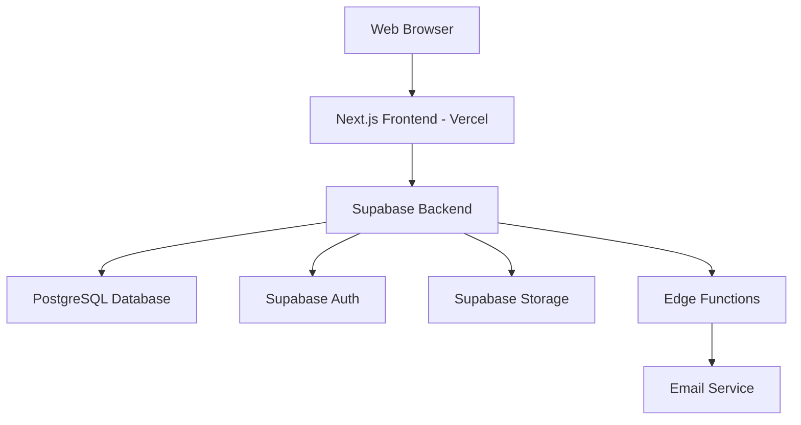

# Design Document

## Overview

The University Job Bank will be a modern, responsive web application built with Next.js deployed on Vercel, using Supabase as the backend-as-a-service platform. The application will feature a clean, intuitive interface optimized for both faculty and student users, with role-based access control and real-time updates.

## Architecture

### High-Level Architecture



### Technology Stack Details

- **Frontend Framework**: Next.js 14 with App Router
- **Styling**: Tailwind CSS for responsive design
- **UI Components**: Shadcn/ui for consistent, accessible components
- **State Management**: React Query for server state, Zustand for client state
- **Authentication**: Supabase Auth with email/password and university domain validation
- **Database**: Supabase PostgreSQL with Row Level Security (RLS)
- **File Storage**: Supabase Storage for resume uploads
- **Deployment**: Vercel with automatic deployments from Git

## Components and Interfaces

### User Interface Components

#### 1. Authentication System
- **Login/Register Pages**: University email validation (@acadiau.ca domain)
- **Role Selection**: Faculty vs Student account types during registration
- **Password Reset**: Email-based password recovery

#### 2. Dashboard Components
- **Faculty Dashboard**: Job posting management, application reviews
- **Student Dashboard**: Job browsing, application tracking
- **Admin Dashboard**: User management, platform analytics

#### 3. Job Management Interface
- **Job Posting Form**: Rich text editor for descriptions, file attachments
- **Job Listing Grid**: Filterable, searchable job cards
- **Job Detail View**: Full job information with application button
- **Application Form**: Cover letter input, resume upload

#### 4. Application Management
- **Application List**: Tabular view with sorting and filtering
- **Application Detail**: Full applicant profile and documents
- **Status Management**: Dropdown for application status updates

### API Design

#### Supabase Database Schema

```sql
-- Users table (extends Supabase auth.users)
CREATE TABLE profiles (
  id UUID REFERENCES auth.users PRIMARY KEY,
  email TEXT UNIQUE NOT NULL,
  full_name TEXT NOT NULL,
  role TEXT CHECK (role IN ('faculty', 'student', 'admin')) NOT NULL,
  department TEXT,
  year_of_study INTEGER, -- for students
  created_at TIMESTAMP WITH TIME ZONE DEFAULT NOW(),
  updated_at TIMESTAMP WITH TIME ZONE DEFAULT NOW()
);

-- Job postings table
CREATE TABLE job_postings (
  id UUID PRIMARY KEY DEFAULT gen_random_uuid(),
  title TEXT NOT NULL,
  description TEXT NOT NULL,
  requirements TEXT,
  compensation TEXT,
  job_type TEXT CHECK (job_type IN ('research_assistant', 'teaching_assistant', 'work_study', 'internship', 'other')),
  department TEXT NOT NULL,
  duration TEXT,
  application_deadline DATE,
  is_active BOOLEAN DEFAULT true,
  posted_by UUID REFERENCES profiles(id) NOT NULL,
  created_at TIMESTAMP WITH TIME ZONE DEFAULT NOW(),
  updated_at TIMESTAMP WITH TIME ZONE DEFAULT NOW()
);

-- Applications table
CREATE TABLE applications (
  id UUID PRIMARY KEY DEFAULT gen_random_uuid(),
  job_id UUID REFERENCES job_postings(id) ON DELETE CASCADE,
  applicant_id UUID REFERENCES profiles(id) ON DELETE CASCADE,
  cover_letter TEXT NOT NULL,
  resume_url TEXT,
  status TEXT CHECK (status IN ('pending', 'reviewed', 'accepted', 'rejected')) DEFAULT 'pending',
  applied_at TIMESTAMP WITH TIME ZONE DEFAULT NOW(),
  updated_at TIMESTAMP WITH TIME ZONE DEFAULT NOW(),
  UNIQUE(job_id, applicant_id)
);

-- Notifications table
CREATE TABLE notifications (
  id UUID PRIMARY KEY DEFAULT gen_random_uuid(),
  user_id UUID REFERENCES profiles(id) ON DELETE CASCADE,
  title TEXT NOT NULL,
  message TEXT NOT NULL,
  type TEXT CHECK (type IN ('application_received', 'status_update', 'new_job', 'deadline_reminder')),
  read BOOLEAN DEFAULT false,
  created_at TIMESTAMP WITH TIME ZONE DEFAULT NOW()
);
```

#### Row Level Security (RLS) Policies

- **Profiles**: Users can read all profiles, update only their own
- **Job Postings**: All authenticated users can read active postings, only faculty can create/update their own
- **Applications**: Students can create applications, faculty can view applications for their jobs
- **Notifications**: Users can only access their own notifications

## Data Models

### Core Entities

#### User Profile
```typescript
interface Profile {
  id: string;
  email: string;
  fullName: string;
  role: 'faculty' | 'student' | 'admin';
  department?: string;
  yearOfStudy?: number; // for students only
  createdAt: string;
  updatedAt: string;
}
```

#### Job Posting
```typescript
interface JobPosting {
  id: string;
  title: string;
  description: string;
  requirements?: string;
  compensation?: string;
  jobType: 'research_assistant' | 'teaching_assistant' | 'work_study' | 'internship' | 'other';
  department: string;
  duration?: string;
  applicationDeadline?: string;
  isActive: boolean;
  postedBy: string;
  createdAt: string;
  updatedAt: string;
  applicationCount?: number;
}
```

#### Application
```typescript
interface Application {
  id: string;
  jobId: string;
  applicantId: string;
  coverLetter: string;
  resumeUrl?: string;
  status: 'pending' | 'reviewed' | 'accepted' | 'rejected';
  appliedAt: string;
  updatedAt: string;
  applicant?: Profile;
  jobPosting?: JobPosting;
}
```

## Error Handling

### Client-Side Error Handling
- **Form Validation**: Real-time validation with clear error messages
- **Network Errors**: Retry mechanisms with user feedback
- **Authentication Errors**: Automatic redirect to login with context preservation
- **File Upload Errors**: Progress indicators and error recovery

### Server-Side Error Handling
- **Database Constraints**: Proper error messages for unique violations
- **Authentication**: JWT validation and refresh token handling
- **File Storage**: Size limits and type validation for uploads
- **Rate Limiting**: Protection against spam applications

### Error Boundaries
- React Error Boundaries for graceful failure handling
- Fallback UI components for broken states
- Error logging to Supabase for debugging

## Testing Strategy

### Frontend Testing
- **Unit Tests**: Jest and React Testing Library for components
- **Integration Tests**: Testing user flows and API interactions
- **E2E Tests**: Playwright for critical user journeys
- **Accessibility Tests**: Automated a11y testing with axe-core

### Backend Testing
- **Database Tests**: Supabase local development with test data
- **RLS Policy Tests**: Ensuring proper access control
- **Edge Function Tests**: Unit tests for email notifications
- **Performance Tests**: Load testing for concurrent users

### Deployment Testing
- **Preview Deployments**: Vercel preview URLs for feature branches
- **Staging Environment**: Separate Supabase project for testing
- **Production Monitoring**: Vercel Analytics and Supabase monitoring

## Security Considerations

### Authentication & Authorization
- University email domain validation (@acadiau.ca)
- Role-based access control with RLS policies
- Secure session management with Supabase Auth

### Data Protection
- HTTPS enforcement on all connections
- File upload validation and virus scanning
- Personal data encryption at rest

### Privacy Compliance
- Clear privacy policy for data collection
- User consent for email notifications
- Data retention policies for inactive accounts

## Performance Optimization

### Frontend Performance
- Next.js App Router with streaming and suspense
- Image optimization with Next.js Image component
- Code splitting and lazy loading for large components
- Caching strategies with React Query

### Backend Performance
- Database indexing on frequently queried columns
- Connection pooling with Supabase
- CDN delivery for static assets via Vercel
- Optimized SQL queries with proper joins

### Monitoring
- Vercel Analytics for frontend performance
- Supabase Dashboard for database metrics
- Error tracking with Sentry integration
- User experience monitoring with Core Web Vitals